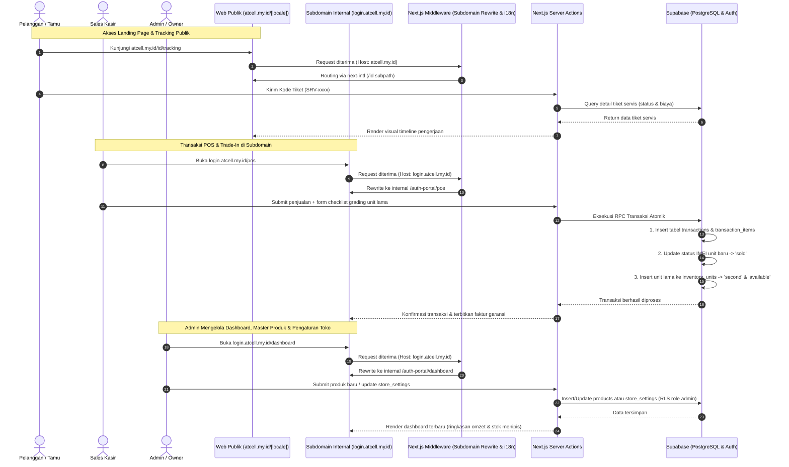
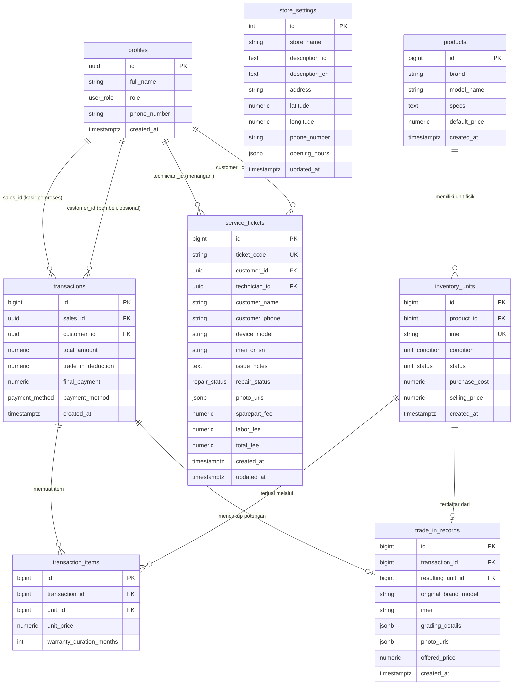

# PRD — Project Requirements Document: Sistem Operasional & Web Profil "At Cell"

## 1. Overview
Aplikasi ini bertujuan untuk mendigitalkan seluruh operasional toko handphone **At Cell** sekaligus menyediakan profil toko modern yang terintegrasi. Masalah utama yang diselesaikan adalah ketidakakuratan pelacakan stok fisik per nomor unik IMEI, kurangnya transparansi proses pengerjaan servis bagi pelanggan, kerumitan pencatatan transaksi tukar tambah (*trade-in*), ketiadaan etalase publik multi-bahasa untuk menjangkau konsumen yang lebih luas, serta belum adanya satu titik kendali bagi pemilik toko untuk memantau performa bisnis dan mengelola data master.

Tujuan utama sistem adalah menyediakan platform berbasis web menggunakan **Next.js**, **Tailwind CSS**, **shadcn/ui**, dan **Supabase (PostgreSQL)** yang memadukan profil publik toko multi-bahasa (`atcell.my.id/[locale]`) dengan portal operasional terpusat berbasis subdomain (`login.atcell.my.id`) untuk empat aktor utama: **Admin/Owner**, **Sales**, **Teknisi**, dan **Pelanggan**.

## 2. Requirements
Berikut adalah persyaratan tingkat tinggi untuk pengembangan sistem:
- **Aksesibilitas & Multi-Domain:** Sistem diakses melalui dua pintu:
  - Root domain publik (`atcell.my.id`) untuk profil toko, etalase stok, dan pelacakan resi servis.
  - Subdomain operasional (`login.atcell.my.id`) untuk gerbang masuk terpadu dan dashboard internal tim.
- **Internasionalisasi (i18n):** Halaman publik mendukung dua bahasa via subpath URL: Bahasa Indonesia (`/id`) sebagai *default* dan Bahasa Inggris (`/en`).
- **Manajemen Peran (RBAC):** Hak akses terisolasi untuk Admin/Owner (kendali penuh, master data, laporan), Sales (kasir/inventaris), Teknisi (servis), dan Pelanggan (riwayat nota & garansi).
- **Pelacakan Presisi IMEI:** Setiap unit handphone fisik wajib terikat pada nomor unik 15 digit IMEI, kondisi (*New* atau *Second*), dan status mutasi stok fisik.
- **Transparansi Layanan Publik:** Pelacakan progres reparasi unit dapat diakses mandiri oleh pelanggan di root domain cukup dengan memasukkan nomor tiket tanpa kewajiban login.
- **Otomasi Trade-In:** Transaksi tukar tambah wajib mengeksekusi aksi ganda secara otomatis: mengurangi total pembayaran unit baru dan mendaftarkan unit lama sebagai stok seken berstatus siap jual (*available*).
- **Visibilitas Bisnis & Konten Toko:** Admin/Owner membutuhkan ringkasan performa penjualan, peringatan stok menipis, serta kendali atas konten profil publik toko (deskripsi, alamat, jam operasional) tanpa perlu mengubah kode aplikasi.

## 3. Core Features
Fitur-fitur kunci yang wajib diimplementasikan:

1. **Landing Page & Profil Toko Multilingual (`atcell.my.id/[locale]`)**
   - **Hero & Identitas Toko:** Profil At Cell, keunggulan layanan, jam buka, dan peta lokasi fisik — seluruh konten ini bersumber dari data yang dikelola Admin, bukan hardcode.
   - **Etalase Ready Stock:** Filter unit handphone siap jual berdasarkan merek dan kondisi (*New*/*Second*), hanya menampilkan unit berstatus `available` dan menyembunyikan data biaya internal.
   - **Language Switcher:** Navigasi toggle bahasa instan antara `/id` dan `/en`.
   - **Widget Lacak Resi:** Input cepat kode tiket servis di halaman beranda yang langsung mengarah ke halaman progres detail.

2. **Dashboard & Manajemen Toko (Admin/Owner) (`login.atcell.my.id/dashboard`)**
   - **Ringkasan Bisnis:** Grafik omzet harian/bulanan, jumlah transaksi, dan jumlah tiket servis aktif.
   - **Peringatan Stok Menipis:** Daftar model produk dengan jumlah unit `available` di bawah ambang batas yang dapat diatur.
   - **Manajemen Master Produk:** Tambah, edit, atau nonaktifkan entri katalog `products` (merek, model, spesifikasi, harga acuan) — kewenangan ini eksklusif untuk Admin.
   - **Manajemen Akun Staf:** Mengundang, menonaktifkan, atau mengubah peran akun Sales dan Teknisi melalui Supabase Auth.
   - **Pengaturan Profil Publik Toko:** Mengelola konten `store_settings` (nama, deskripsi dwibahasa, alamat, koordinat peta, jam operasional) yang tampil di landing page.
   - **Laporan Performa Teknisi:** Ringkasan jumlah tiket selesai dan rata-rata waktu pengerjaan per teknisi.

3. **Manajemen Inventaris Unit & IMEI (`login.atcell.my.id/inventory`)**
   - Sales meregistrasi unit fisik (nomor IMEI) di bawah katalog produk yang sudah didefinisikan Admin.
   - Form registrasi batch nomor IMEI 15 digit.
   - Pemantauan status unit fisik: `available`, `reserved`, `sold`, `in_service`, dan `returned`.

4. **Point of Sale (POS) & Garansi IMEI (`login.atcell.my.id/pos`)**
   - Pemilihan produk kasir wajib memilih nomor IMEI fisik aktif yang berstatus `available`.
   - **Registrasi Pelanggan Cepat (Guest):** Jika pelanggan belum memiliki akun, Sales dapat membuat catatan pelanggan ringan (nama & nomor telepon) tanpa proses login penuh, agar histori garansi tetap tertaut.
   - Perhitungan checkout otomatis (subtotal, potongan trade-in, dan metode pembayaran).
   - Cetak/ekspor faktur transaksi bergaransi resmi toko yang memuat nomor IMEI.
   - Mutasi status IMEI dari `available` menjadi `sold` secara instan.

5. **Sistem Tukar Tambah / Trade-In (`login.atcell.my.id/pos`)**
   - Checklist formulir inspeksi kondisi unit lama (layar, bodi, baterai, fungsi biometrik, sinyal), termasuk unggah foto kondisi fisik ke Supabase Storage.
   - Kalkulasi taksiran harga unit lama sebagai diskon langsung untuk unit baru.
   - Pendaftaran otomatis unit bekas pelanggan ke tabel `inventory_units` dengan status `available` dan kondisi `second`.

6. **Meja Kerja Servis & Pelacakan Mandiri**
   - Pendaftaran tiket servis masuk di kasir/teknisi dengan kode resi unik: `SRV-YYYYMMDD-XXXX`, dibuat otomatis oleh sistem untuk menjamin keunikan.
   - Workflow pengerjaan teknisi: `received` → `diagnosing` → `waiting_approval` → `in_progress` → `completed` → `picked_up`.
   - Rincian biaya transparan yang memisahkan biaya suku cadang (*sparepart*) dan jasa teknisi (*labor*), dilengkapi unggahan foto kondisi/bukti pengerjaan.
   - Halaman pelacakan publik di `atcell.my.id/[locale]/tracking` dengan visualisasi linier (*stepper/timeline*), dapat diakses tanpa login menggunakan kode tiket saja.

## 4. User Flow

1. **Alur Pengunjung & Pelanggan Publik (`atcell.my.id`):**
   - Pengunjung membuka `atcell.my.id/id` atau `/en` untuk mengecek profil toko dan stok handphone.
   - Untuk mengecek status servis, pengunjung memasukkan nomor tiket (`SRV-xxxx`) di menu pelacakan dan sistem langsung menampilkan tahapan reparasi serta total biaya tanpa perlu login.

2. **Alur Akses Subdomain & Login (`login.atcell.my.id`):**
   - Pengguna (Admin, Sales, Teknisi, atau Pelanggan) membuka `login.atcell.my.id` dan menginput email serta kata sandi.
   - Middleware memvalidasi sesi cookie lintas domain (`.atcell.my.id`) dan mengarahkan pengguna sesuai perannya:
     - **Admin/Owner:** Diarahkan ke `/dashboard`.
     - **Sales:** Diarahkan ke terminal kasir `/pos`.
     - **Teknisi:** Diarahkan ke meja servis `/service`.
     - **Pelanggan:** Diarahkan ke riwayat faktur garansi `/account`.

3. **Alur Admin/Owner (Dashboard & Master Data):**
   - Admin memantau ringkasan omzet, jumlah transaksi, dan panel peringatan stok menipis di `/dashboard`.
   - Admin menambah atau memperbarui katalog `products`, mengelola akun staf, serta memperbarui konten profil publik toko (`store_settings`).
   - Admin meninjau laporan performa teknisi secara berkala.

4. **Alur Transaksi Kasir & Trade-In (Sales):**
   - Sales memilih model HP yang dibeli pelanggan dan memilih nomor IMEI fisik yang tersedia di etalase; jika pelanggan belum punya akun, Sales membuat catatan pelanggan ringan (nama & telepon).
   - Jika ada tukar tambah: Sales membuka form grading, mengisi kondisi fisik handphone lama beserta foto, dan sistem menghitung nilai taksiran.
   - Pelanggan membayar selisih harga; sistem serentak mengubah status unit baru menjadi `sold`, mendaftarkan unit lama menjadi stok seken `available`, dan mencetak nota transaksi bergaransi.

5. **Alur Reparasi Servis (Teknisi):**
   - Teknisi membuka daftar tiket servis, melakukan diagnosa, dan memasukkan rincian harga sparepart serta ongkos jasa.
   - Teknisi memperbarui status tiket secara berkala hingga berstatus `completed`.
   - Saat pelanggan datang mengambil unit, kasir/teknisi mencatat pelunasan dan mengubah status tiket menjadi `picked_up`.

## 5. Architecture

Pola akses yang sama — *host-based middleware rewrite* dan penegakan otorisasi via RLS Supabase — berlaku konsisten untuk seluruh rute privat (`/dashboard`, `/pos`, `/service`, `/account`), sehingga logika perutingan tidak perlu diduplikasi per peran.

## 6. Database Schema

Berikut adalah Entity Relationship Diagram (ERD) yang menggambarkan struktur database utama:

| Tabel | Deskripsi |
|-------|-----------|
| **profiles** | Data profil pengguna yang terhubung dengan `auth.users` Supabase; kolom `role` kini mencakup empat nilai: `admin`, `sales`, `technician`, `customer` |
| **store_settings** | Tabel tunggal (singleton) untuk konten profil publik toko: nama, deskripsi dwibahasa, alamat, koordinat peta, dan jam operasional — dikelola Admin, ditampilkan di landing page |
| **products** | Master data seri atau model handphone (merek, tipe model, spesifikasi, dan harga acuan); hanya dapat dibuat/diubah oleh Admin |
| **inventory_units** | Pencatatan setiap unit fisik handphone dengan nomor IMEI unik, kondisi (`unit_condition`), dan status stok (`unit_status`) |
| **transactions** | Induk transaksi kasir penjualan, potongan tukar tambah, total bersih pembayaran, dan metode bayar (`payment_method`); `customer_id` bersifat opsional untuk pembeli tanpa akun penuh |
| **transaction_items** | Rincian unit handphone spesifik per IMEI yang terjual beserta durasi garansi toko |
| **trade_in_records** | Rekam hasil inspeksi grading handphone bekas beserta foto kondisi (`photo_urls`), yang langsung menautkan unit masuk baru ke inventaris |
| **service_tickets** | Tiket perbaikan servis, nomor resi unik, status progres pengerjaan (`repair_status`), foto kondisi/bukti pengerjaan, serta kalkulasi rincian sparepart dan jasa; `customer_id` opsional untuk pelanggan walk-in |

## 7. Design & Technical Constraints

Bagian ini mengatur batasan teknis dan panduan desain yang harus dipatuhi.

1. **High-Level Technology:**
   - **Framework & Styling:** Next.js (App Router, Server Actions) dengan Tailwind CSS dan komponen antarmuka shadcn/ui.
   - **Internasionalisasi:** next-intl dengan format rute `/[locale]` untuk seluruh halaman pada domain publik.
   - **Backend & Storage:** Supabase (PostgreSQL Database, Supabase Auth, Supabase Storage untuk foto kondisi barang servis/trade-in).
   - **Form Engine:** React Hook Form terintegrasi dengan validasi skema Zod.

2. **Domain, Subdomain & Routing Rules:**
   - **Edge Middleware:** Mengatur rewrite internal untuk request dari hostname `login.atcell.my.id` langsung ke direktori `/auth-portal`.
   - **Cross-Subdomain Cookies:** Sesi autentikasi Supabase wajib menggunakan konfigurasi cookie wildcard `.atcell.my.id` di mode produksi agar status login terbaca di semua domain toko.
   - **Local Environment Setup:** Pengujian lokal memanfaatkan konfigurasi virtual domain pada file hosts (`atcell.local` dan `login.atcell.local`).

3. **Integritas Database & Enum Constraints:**
   - **Validasi IMEI:** Kolom `imei` diatur `UNIQUE` dengan panjang tepat 15 karakter angka (via `CHECK` constraint/regex).
   - **Enum Native PostgreSQL:** Nilai-nilai status dibatasi menggunakan tipe enum, bukan string bebas:
     - `user_role`: `admin`, `sales`, `technician`, `customer`.
     - `unit_condition`: `new`, `second`.
     - `unit_status`: `available`, `reserved`, `sold`, `in_service`, `returned`.
     - `repair_status`: `received`, `diagnosing`, `waiting_approval`, `in_progress`, `completed`, `picked_up`.
     - `payment_method`: `cash`, `transfer`, `qris`, `debit`, `credit`.
   - **Generate Kode Tiket:** `ticket_code` (`SRV-YYYYMMDD-XXXX`) dibuat otomatis melalui fungsi/trigger `BEFORE INSERT` di database agar format dan keunikan terjamin secara atomik, tanpa race condition saat beberapa tiket dibuat di hari yang sama.
   - **Integritas Trade-in:** Eksekusi tukar tambah wajib dijalankan melalui transaksi database atomik (PostgreSQL RPC) untuk mencegah kegagalan mutasi ganda.
   - **Pelanggan Tanpa Akun Penuh:** `customer_id` pada `transactions` dan `service_tickets` bersifat nullable; Sales/Teknisi dapat mencatat nama dan nomor telepon pelanggan secara langsung untuk transaksi walk-in tanpa mewajibkan pembuatan akun.

4. **Row Level Security (RLS) per Peran:**
   - **Admin:** Akses penuh (SELECT/INSERT/UPDATE/DELETE) ke seluruh tabel, termasuk `products` dan `store_settings`.
   - **Sales:** Modifikasi stok `inventory_units` dan pembuatan `transactions`/`trade_in_records` dibatasi hanya untuk user berstatus `role = 'sales'`; tidak berhak mengubah `products`.
   - **Teknisi:** Modifikasi status dan kalkulasi biaya pada `service_tickets` hanya diizinkan untuk user berstatus `role = 'technician'`.
   - **Publik/Anonim (Etalase & Tracking):**
     - Pelacakan servis di domain publik dieksekusi melalui Server Action terisolasi yang hanya mencocokkan nilai `ticket_code`, tanpa mengekspos data pelanggan lain.
     - Akses baca etalase produk **tidak** langsung ke tabel `products`/`inventory_units`, melainkan melalui view khusus `v_public_inventory` yang hanya mengekspos kolom aman (merek, model, kondisi, harga jual) dan menyembunyikan `purchase_cost`; RLS `SELECT` untuk role `anon` hanya diberikan pada view ini.

5. **Manajemen Media & File Storage:**
   - Foto kondisi trade-in dan bukti pengerjaan servis diunggah ke bucket Supabase Storage terpisah (`trade-in-photos`, `service-photos`).
   - URL hasil unggahan disimpan sebagai array pada kolom `photo_urls` (jsonb) di `trade_in_records` dan `service_tickets`.

6. **Typography Rules:**
   Sistem antarmuka (UI) wajib menggunakan konfigurasi font variable sebagai berikut untuk menjaga konsistensi visual:
   - **Sans:** `Geist Mono, ui-monospace, monospace`
   - **Serif:** `serif`
   - **Mono:** `JetBrains Mono, monospace`
