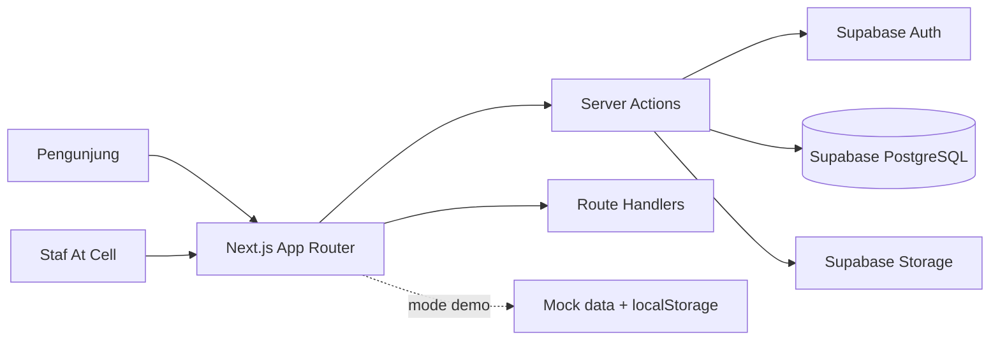

# At Cell Web

At Cell Web adalah aplikasi web untuk toko handphone **At Cell** di Paku Jaya, Serpong Utara. Proyek ini menggabungkan etalase publik dwibahasa dengan portal operasional_INTERNAL untuk admin, kasir, teknisi, dan pelanggan.

Aplikasi memiliki dua mode yang sengaja dipisahkan:

- **Demo lokal:** portal memakai data mock dan `localStorage` tanpa Supabase.
- **Mode live:** Supabase menjadi sumber data bersama, dengan autentikasi, Row Level Security (RLS), Storage, dan validasi backend.

## Fitur Utama

### Halaman publik

- Landing page dan profil toko dalam Bahasa Indonesia dan Inggris.
- Katalog handphone ready stock dengan filter merek dan kondisi.
- Informasi layanan, garansi, pengiriman, pembayaran, kontak, dan trade-in.
- Pelacakan servis publik tanpa login menggunakan kode tiket.
- Tema terang/gelap dan desain responsif.

### Portal operasional

- Dashboard bisnis untuk admin.
- Inventaris unit dengan validasi IMEI 15 digit dan status stok.
- Point of Sale dengan pemilihan unit IMEI, transaksi, garansi, dan cetak nota.
- Trade-in dengan inspeksi unit lama dan registrasi otomatis ke inventaris.
- Meja kerja servis dengan tiket unik serta pembaruan status pengerjaan.
- Master produk, pengaturan toko, staf, laporan, dan akun pelanggan.
- Kontrol akses berbasis peran untuk admin, sales, teknisi, dan customer.

## Peran Pengguna

| Peran | Halaman utama | Hak akses utama |
|-------|---------------|------------------|
| `admin` | `/portal/dashboard` | Dashboard, produk, staf, pengaturan, laporan, dan seluruh modul operasional |
| `sales` | `/portal/pos` | POS, inventaris, transaksi, trade-in, dan servis |
| `technician` | `/portal/service` | Tiket servis, diagnosa, biaya, dan progres pengerjaan |
| `customer` | `/portal/account` | Riwayat transaksi, garansi, dan tiket milik akun tersebut |

## Arsitektur



- **Frontend dan server:** Next.js 16, React 19, TypeScript, dan Tailwind CSS 4.
- **Data production:** Supabase PostgreSQL, Auth, dan Storage.
- **Akses data production:** Server Actions memakai Drizzle/PostgreSQL atau Supabase server client sesuai kebutuhan modul.
- **Keamanan:** Supabase RLS, verifikasi peran server-side, route guard, validasi Zod, dan policy Storage.
- **Drizzle:** dipakai sebagai representasi dan artefak referensi schema. Migration production tetap memakai SQL canonical di `supabase/migrations/`.
- **Deployment:** Coolify menjadi primary, Vercel menjadi standby, dan keduanya memakai Supabase yang sama.

## Teknologi

| Teknologi | Versi atau penggunaan |
|-----------|----------------------|
| Next.js | `16.3.5`, App Router dan Server Actions |
| React | `19.2.8` |
| TypeScript | Mode strict |
| Tailwind CSS | `4` |
| Supabase | PostgreSQL, Auth, SSR, dan Storage |
| Drizzle ORM | Skema dan akses PostgreSQL sisi server |
| React Hook Form + Zod | Form dan validasi input |
| Node.js Test Runner | Test keamanan, migrasi, backup, health, dan validasi |
| npm | Package manager repo |

## Menjalankan Secara Lokal

### Prasyarat

- Node.js `22` atau lebih baru.
- npm.
- Supabase hanya diperlukan untuk mode live.

### Instalasi

```bash
git clone https://github.com/neiaki/KP.git
cd KP
npm ci
cp .env.example .env.local
npm run dev
```

Buka:

- Halaman publik: `http://localhost:3000/id`
- Katalog: `http://localhost:3000/id/catalog`
- Login portal: `http://localhost:3000/id/login`
- Alias login portal lama: `http://localhost:3000/portal/login`

Untuk demo lokal, environment Supabase dan `DATABASE_URL` boleh dibiarkan kosong. Jangan memasukkan data mock ke database production.

## Konfigurasi Supabase

Untuk menjalankan mode live:

1. Buat project Supabase khusus At Cell.
2. Jalankan migration berikut secara berurutan dari SQL Editor:
   - `supabase/migrations/0001_atcell_schema.sql`
   - `supabase/migrations/0002_harden_atcell_schema.sql`
   - `supabase/migrations/0003_lock_legacy_helpers.sql`
3. Isi environment pada `.env.local` atau secret manager platform:
   - `NEXT_PUBLIC_SUPABASE_URL`
   - `NEXT_PUBLIC_SUPABASE_PUBLISHABLE_KEY` atau key anon lama
   - `SUPABASE_SECRET_KEY` atau service role key lama
   - `DATABASE_URL` dari connection pooler
   - `SUPABASE_COOKIE_DOMAIN` untuk sesi lintas subdomain production
4. Buat user pertama melalui Supabase Auth, lalu tetapkan perannya sebagai `admin` pada profil yang sesuai.
5. Verifikasi `/api/health/ready` sebelum membuka traffic production.

Jangan pernah commit `.env.local`, password database, service role key, atau token lain ke repository.

## Integritas Data

- IMEI wajib tepat 15 digit angka dan harus unik.
- POS hanya dapat menjual unit berstatus `available` untuk mencegah double-sell.
- Trade-in Sekaligus mencatat transaksi dan mendaftarkan unit lama sebagai stok second.
- Kode tiket servis mengikuti format `SRV-YYYYMMDD-XXXX`.
- Alur servis mencakup status pengerjaan dari penerimaan hingga unit diambil pelanggan.
- RLS dan pemeriksaan peran dijalankan lagi pada Server Actions yang memakai koneksi database langsung.

## Perintah Pengembangan

| Perintah | Kegunaan |
|----------|-----------|
| `npm run dev` | Menjalankan development server |
| `npm run build` | Membuat build production |
| `npm start` | Menjalankan hasil build production |
| `npm test` | Menjalankan test suite |
| `npx tsc --noEmit` | Melakukan typecheck |
| `npm run lint` | Menjalankan ESLint |
| `npm run smoke:deployment -- <primary-url> <fallback-url>` | Memeriksa endpoint health pada deployment |

Validasi lengkap sebelum rilis:

```bash
npm test
npx tsc --noEmit
npm run lint
npm run build
```

## Health Check

- `GET /api/health/live` memeriksa proses Next.js.
- `GET /api/health/ready` memeriksa environment, koneksi PostgreSQL, schema wajib, dan secret server.

Endpoint `/ready` harus menjadi target health check Coolify, Vercel, dan DNS/load balancer. Respons `503` berarti deployment belum siap dan tidak boleh dialihkan ke data mock.

## Backup dan Restore

Backup logis database:

```bash
SOURCE_DATABASE_URL="..." BACKUP_DIR="/path/backup" npm run backup:postgres
```

Restore ke database sementara:

```bash
psql "$RESTORE_DATABASE_URL" -f scripts/restore-target-bootstrap.sql
ALLOW_RESTORE=YES RESTORE_DATABASE_URL="..." DUMP_FILE="/path/backup/atcell-....dump" npm run restore:postgres
```

Restore bersifat destruktif. Jalankan hanya terhadap database restore sementara, bukan database production. Backup Auth dan Storage tetap dikelola sebagai bagian dari layanan Supabase.

## Struktur Proyek

```text
src/app/[locale]/       Halaman publik dwibahasa
src/app/portal/         Portal operasional staf
src/app/api/            Health check dan endpoint aplikasi
src/components/         Komponen publik, portal, dan UI dasar
src/lib/actions/        Server Actions per modul bisnis
src/lib/                Store, validasi, auth, dan utilitas
src/db/                 Schema dan koneksi Drizzle
supabase/migrations/    Migration SQL canonical untuk production
scripts/                Backup, restore, dan smoke test deployment
tests/                  Test keamanan, validasi, health, dan migrasi
docs/                   PRD, kebutuhan, use case, dan runbook deployment
```

## Deployment

Strategi deployment saat ini adalah active-passive:

- Coolify VPS sebagai primary.
- Vercel sebagai standby.
- Supabase PostgreSQL, Auth, dan Storage sebagai backend bersama.
- Database production tidak disimpan di container aplikasi.

Vercel Hobby tidak boleh digunakan untuk traffic bisnis At Cell. Gunakan paket Pro atau Enterprise. Ikuti runbook lengkap di [`docs/DEPLOYMENT-REDUNDANCY.md`](docs/DEPLOYMENT-REDUNDANCY.md).

## Dokumentasi

- [`docs/PRD-AtCell.md`](docs/PRD-AtCell.md): vision, kebutuhan, fitur, user flow, dan rancangan arsitektur.
- [`docs/requirement-2.0.md`](docs/requirement-2.0.md): SRS aktif yang memuat aktor dan kebutuhan aplikasi.
- [`docs/DEPLOYMENT-REDUNDANCY.md`](docs/DEPLOYMENT-REDUNDANCY.md): deployment, migration, DNS, backup, restore, dan rollout.
