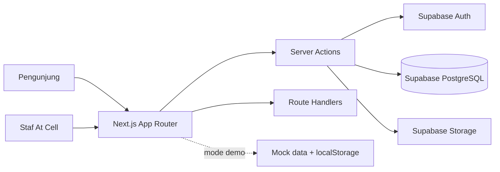

# At Cell Web

At Cell Web adalah aplikasi web untuk toko handphone **At Cell** di Paku Jaya, Serpong Utara. Proyek ini menggabungkan etalase publik dwibahasa dengan portal operasional_INTERNAL untuk admin, kasir, teknisi, dan pelanggan.

## Situs live

Aplikasi production sudah berjalan di domain berikut:

| Domain | Isi |
|------|-----|
| `https://atcell.my.id` | Etalase publik, katalog, pelacakan servis, dan trade-in |
| `https://www.atcell.my.id` | Alias domain utama, dilayani aplikasi yang sama |
| `https://login.atcell.my.id` | Halaman masuk staf, dilayani lewat rewrite ke `/id/login` |

Etalase tersedia dalam dua bahasa di `https://atcell.my.id/id` dan
`https://atcell.my.id/en`. Login staf juga bisa dibuka langsung di
`https://atcell.my.id/id/login`.

## Status

Aplikasi sengaja dipisah menjadi dua mode:

- **Production (live):** Supabase menjadi sumber data bersama, dengan autentikasi, Row Level Security (RLS), Storage, dan validasi backend.
- **Demo lokal:** portal memakai data mock dan `localStorage` tanpa Supabase, jadi repo ini tetap bisa dijalankan tanpa kredensial apa pun.

Pemilihan mode dilakukan otomatis, bukan lewat flag manual. Backend live aktif
saat `NODE_ENV` bernilai `production` atau saat `NEXT_PUBLIC_SUPABASE_URL`
terisi, dan selain itu portal memakai data mock lokal. Lihat `liveBackendEnabled`
di `src/lib/store.ts`.

## Fitur Utama

### Halaman publik

- Landing page dan profil toko dalam Bahasa Indonesia dan Inggris.
- Etalase HP siap jual dengan filter merek dan kondisi.
- Informasi layanan, garansi, pengiriman, pembayaran, kontak, dan trade-in.
- Pelacakan servis publik tanpa login menggunakan kode tiket.
- Tema terang/gelap dan desain responsif.

### Portal operasional

- Dashboard bisnis untuk admin.
- Inventaris unit dengan validasi IMEI 15 digit dan status stok.
- Point of Sale dengan pemilihan unit IMEI, transaksi, garansi, dan cetak nota.
- Trade-in dengan inspeksi unit lama dan registrasi otomatis ke inventaris.
- Meja kerja servis dengan tiket unik serta pembaruan status pengerjaan.
- Master produk, pengaturan toko, staf, laporan, dan akun pelanggan.
- Kontrol akses berbasis peran untuk admin, sales, teknisi, dan pelanggan.

## Peran Pengguna

| Peran | Halaman utama | Hak akses utama |
|-------|---------------|------------------|
| `admin` | `/portal/dashboard` | Dashboard, produk, staf, pengaturan, laporan, dan seluruh modul operasional |
| `sales` | `/portal/pos` | POS, inventaris, transaksi, trade-in, dan servis |
| `technician` | `/portal/service` | Tiket servis, diagnosa, biaya, dan progres pengerjaan |
| `customer` | `/portal/account` | Riwayat transaksi, garansi, dan tiket milik akun tersebut |

## Arsitektur


```mermaid
flowchart LR
    Public[Pengunjung] --> Next[Next.js App Router]
    Staff[Staf At Cell] --> Next
    Next --> Actions[Server Actions]
    Next --> Routes[Route Handlers]
    Actions --> Auth[Supabase Auth]
    Actions --> DB[(Supabase PostgreSQL)]
    Actions --> Storage[Supabase Storage]
    Next -. mode demo .-> Mock[Mock data + localStorage]
```

- **Frontend dan server:** Next.js 16, React 19, TypeScript, dan Tailwind CSS 4.
- **Data production:** Supabase PostgreSQL, Auth, dan Storage.
- **Akses data production:** Server Actions memakai Drizzle/PostgreSQL atau Supabase server client sesuai kebutuhan modul.
- **Keamanan:** Supabase RLS, verifikasi peran server-side, route guard, validasi Zod, dan policy Storage.
- **Drizzle:** dipakai sebagai representasi dan artefak referensi schema. Migration production tetap memakai SQL canonical di `supabase/migrations/`.
- **Deployment:** Coolify menjadi primary. Supabase menjadi sumber data production dan restore test lokal hanya berada di Coolify.

## Teknologi

| Teknologi | Versi atau penggunaan |
|-----------|----------------------|
| Next.js | `16.3.6`, App Router dan Server Actions |
| React | `19.2.8` |
| TypeScript | Mode strict |
| Tailwind CSS | `4` |
| Supabase | PostgreSQL, Auth, SSR, dan Storage |
| Drizzle ORM | Skema dan akses PostgreSQL sisi server |
| Zod | Validasi input di Server Action (`src/lib/validations.ts`) |
| Node.js Test Runner | Test keamanan, migrasi, backup, health, dan validasi |
| Sentry | Pelacakan galat production, opsional lewat `SENTRY_DSN` |
| npm | Package manager repo |

## Menjalankan Secara Lokal

### Prasyarat

- Node.js `22` atau lebih baru.
- npm.
- Supabase hanya diperlukan untuk mode live.

### Instalasi

```bash
git clone https://github.com/neiaki/KP.git
cd KP
npm ci
cp .env.example .env.local
npm run dev
```

Buka:

- Halaman publik: `http://localhost:3000/id`
- Versi Inggris: `http://localhost:3000/en`
- Katalog: `http://localhost:3000/id/catalog`
- Login staf: `http://localhost:3000/id/login`
- URL lama `http://localhost:3000/portal/login` masih dilayani, tapi isinya hanya pengalihan ke `/id/login`

Untuk demo lokal, environment Supabase dan `DATABASE_URL` boleh dibiarkan kosong. Jangan memasukkan data mock ke database production.

## Konfigurasi Supabase

Untuk menjalankan mode live:

1. Buat project Supabase khusus At Cell.
2. Jalankan seluruh berkas di `supabase/migrations/` secara berurutan dari SQL
   Editor, sesuai abjad nama berkasnya. Daftar lengkap ada di
   `docs/DEPLOYMENT-REDUNDANCY.md`; jangan menyalin sebagian saja, karena
   beberapa migrasi mengubah hasil migrasi sebelumnya.
3. Isi environment pada `.env.local` atau secret manager platform:
   - `NEXT_PUBLIC_SUPABASE_URL`
   - `NEXT_PUBLIC_SUPABASE_PUBLISHABLE_KEY` atau key anon lama
   - `SUPABASE_SECRET_KEY` atau service role key lama
   - `DATABASE_URL` dari connection pooler
   - `SUPABASE_COOKIE_DOMAIN` untuk sesi lintas subdomain production
4. Buat user pertama melalui Supabase Auth, lalu tetapkan perannya sebagai `admin` pada profil yang sesuai.
5. Verifikasi `/api/health/ready` sebelum membuka traffic production.

Jangan pernah commit `.env.local`, password database, service role key, atau token lain ke repository.

## Integritas Data

- IMEI wajib tepat 15 digit angka dan harus unik.
- POS hanya dapat menjual unit berstatus `available` untuk mencegah double-sell.
- Trade-in Sekaligus mencatat transaksi dan mendaftarkan unit lama sebagai stok second.
- Kode tiket servis mengikuti format `SRV-YYYYMMDD-XXXXXXXX`, yaitu 8 karakter base32 dari alfabet tanpa `I`, `L`, `O`, dan `U` supaya mudah ditulis di nota.
- Alur servis mencakup status pengerjaan dari penerimaan hingga unit diambil pelanggan.
- RLS dan pemeriksaan peran dijalankan lagi pada Server Actions yang memakai koneksi database langsung.

## Perintah Pengembangan

| Perintah | Kegunaan |
|----------|-----------|
| `npm run dev` | Menjalankan development server |
| `npm run build` | Membuat build production |
| `npm start` | Menjalankan hasil build production |
| `npm test` | Menjalankan test suite |
| `npx tsc --noEmit` | Melakukan typecheck |
| `npm run lint` | Menjalankan ESLint |
| `npm run smoke:deployment -- <primary-url> <fallback-url>` | Memeriksa endpoint health pada deployment |

Validasi lengkap sebelum rilis:

```bash
npm test
npx tsc --noEmit
npm run lint
npm run build
```

## Health Check

- `GET /api/health/live` memeriksa proses Next.js.
- `GET /api/health/ready` memeriksa environment, koneksi PostgreSQL, schema wajib, dan secret server.

Endpoint `/ready` harus menjadi target health check Coolify. Respons `503` berarti deployment belum siap dan tidak boleh dialihkan ke data mock.

Batas `/ready` perlu dipahami: endpoint itu memeriksa Supabase, konfigurasi
database, jangkauan koneksi, schema wajib, dan secret server. Itupun tidak
menangkap halaman yang bergantung pada data live tapi gagal dirender.
`/id` pernah timeout sementara `/ready` tetap hijau, jadi health check ini
menjawab "apakah prosesnya hidup dan database bisa dijangkau", bukan
"apakah semua halaman berfungsi". Untuk jawaban kedua, lihat
[Pelacakan Galat](#pelacakan-galat-sentry) dan monitor uptime eksternal.

## Pelacakan Galat (Sentry)

Sentry menangkap galat production dan mengirimkannya ke dashboard
sentry.io. Opt-in lewat `SENTRY_DSN`: kalau kosong, `Sentry.init()` tidak
dijalankan sama sekali, tidak ada request keluar, dan tidak ada biaya.

| Berkas | Sisi | Yang diinisialisasi |
|--------|------|---------------------|
| `src/instrumentation.ts` | Server | SDK Node untuk Server Actions, Route Handlers, komponen server |
| `src/instrumentation-client.ts` | Browser | SDK browser, sesi direkam hanya saat ada galat |

Dua boundary galat Next.js sudah melapor: `src/app/error.tsx` untuk galat
segmen, dan `src/app/global-error.tsx` untuk galat yang membuat root layout
sendiri crash.

Data pelanggan disaring sebelum keluar dari server: kode tiket servis di
query string (yang membuat halaman lacak bisa dibuka tanpa login), body
request, cookie, dan header `Authorization`. Sisi browser tidak menyaring
nilai, hanya membuang event yang bukan milik aplikasi.

Isi env di platform (Coolify):

```text
NEXT_PUBLIC_SENTRY_DSN=https://<key>@o<org>.ingest.sentry.io/<project>
SENTRY_DSN=https://<key>@o<org>.ingest.sentry.io/<project>
NEXT_PUBLIC_COMMIT_SHA=atcell-web@<commit>
```

Tanpa `NEXT_PUBLIC_COMMIT_SHA`, Sentry tetap melapor tetapi nomor versinya
kosong sehingga galat dari beberapa deploy tercampur menjadi satu grup.
Nilai itu diisi otomatis dari tag image Coolify (`sha-<commit>`) oleh langkah
deploy di
[`docs/DEPLOYMENT-REDUNDANCY.md`](docs/DEPLOYMENT-REDUNDANCY.md).

Rekam sesi dan tracing performance sengaja dimatikan. At Cell melayani
pengunjung etalase yang luas, sementara yang perlu ditelusuri saat ada
masalah adalah alur portal staf, jadi tidak ada alasan bisnis merekam
navigasi rutin.

## Backup dan Restore

Backup logis database:

```bash
SOURCE_DATABASE_URL="..." BACKUP_DIR="/path/backup" npm run backup:postgres
```

Restore ke database sementara:

```bash
psql "$RESTORE_DATABASE_URL" -f scripts/restore-target-bootstrap.sql
ALLOW_RESTORE=YES RESTORE_DATABASE_URL="..." DUMP_FILE="/path/backup/atcell-....dump" npm run restore:postgres
```

Restore bersifat destruktif. Jalankan hanya terhadap database restore sementara, bukan database production. Backup Auth dan Storage tetap dikelola sebagai bagian dari layanan Supabase.

## Struktur Proyek

```text
src/app/(public)/[locale]/  Halaman publik dwibahasa, termasuk /id dan /en
src/app/(portal)/portal/   Portal operasional staf
src/app/api/                Health check dan endpoint aplikasi
src/components/             Komponen publik, portal, dan UI dasar
src/context/                Provider store sisi klien
src/db/                     Skema dan koneksi Drizzle
src/lib/actions/            Server Actions per modul bisnis
src/lib/supabase/           Klien Supabase untuk browser, server, dan admin
src/lib/                    Store, validasi, auth, dan utilitas
src/types/                  Tipe domain dan tipe baris database
public/                     Foto produk, logo, dan aset statis
supabase/migrations/        Migration SQL canonical untuk production
scripts/                    Backup, restore, dan smoke test deployment
tests/                      Test keamanan, validasi, health, dan migrasi
docs/                       PRD, kebutuhan, use case, dan runbook deployment
.github/workflows/          Workflow CI dan build image Docker ke GHCR
```

## Deployment

Build image tidak pernah terjadi di VPS production. Pipeline berjalan begini:

1. Push ke branch `main` memicu GitHub Actions di `.github/workflows/docker-publish.yml`.
2. Workflow menjalankan `npm test`, `npx tsc --noEmit`, dan `npm run lint`. Image hanya dibangun kalau ketiganya hijau.
3. Build berjalan di runner GitHub lewat `Dockerfile` yang memakai `node:22-bookworm-slim`, lalu hasilnya di-push ke GHCR sebagai `ghcr.io/neiaki/kp:sha-<commit>`.
4. Coolify di VPS hanya menarik tag yang sudah dipin itu lewat `Dockerfile.coolify`. Tag wajib `sha-<commit>` dan tidak boleh `latest`, karena Coolify menjalankan `docker build` tanpa `--pull`, sehingga tag `latest` bisa terlanjur tersimpan di lokal VPS. Deploy lalu terlihat hijau sambil tetap menjalankan image lama. `tests/deploy-image-pin.test.ts` menjaga aturan ini.
5. Coolify memasang health check ke `GET /api/health/ready`. Selama jawabannya bukan 200, deployment belum siap.

Karena tag ditulis manual di dalam `Dockerfile.coolify`, ada satu commit keterlambatan. Image untuk commit Q baru ada setelah commit itu di-push, jadi menulis tag `sha-Q` membuat commit yang baru ikut ter-deploy menjalankan image commit sebelumnya.

Batasan production lainnya:

- Coolify VPS sebagai satu-satunya host aplikasi production.
- Supabase PostgreSQL, Auth, dan Storage sebagai backend bersama.
- Coolify PostgreSQL hanya menjadi restore target private.
- Database production tidak disimpan di container aplikasi.
- Domain final dan TLS dikonfigurasi setelah deployment dan health check lulus.

Ikuti runbook lengkap di [`docs/DEPLOYMENT-REDUNDANCY.md`](docs/DEPLOYMENT-REDUNDANCY.md).

## Dokumentasi

Indeks lengkap ada di [`docs/README.md`](docs/README.md).

- [`docs/PRD-AtCell.md`](docs/PRD-AtCell.md): vision, kebutuhan, fitur, user flow, dan rancangan arsitektur.
- [`docs/UC-AtCell.md`](docs/UC-AtCell.md): 18 use case per aktor, lengkap dengan diagram Mermaid arsip di dalam berkasnya.
- [`docs/requirement-2.0.md`](docs/requirement-2.0.md): SRS aktif yang memuat aktor dan kebutuhan aplikasi.
- [`docs/DEPLOYMENT-REDUNDANCY.md`](docs/DEPLOYMENT-REDUNDANCY.md): deployment, migration, DNS, backup, restore, dan rollout.
- [`docs/SECRET-ROTATION.md`](docs/SECRET-ROTATION.md): urutan mengganti secret yang pernah bocor, lengkap dengan verifikasinya.
- [`docs/CSP.md`](docs/CSP.md): cara kerja Content-Security-Policy berbasis nonce, directive yang dipakai, dan alasan setiap keputusan.
- [`docs/VPS-HARDENING.md`](docs/VPS-HARDENING.md): catatan audit host production dan langkah pengerasannya, untuk direview manusia sebelum dijalankan.

