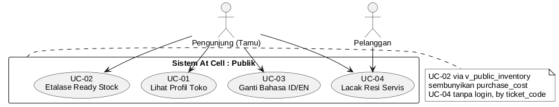
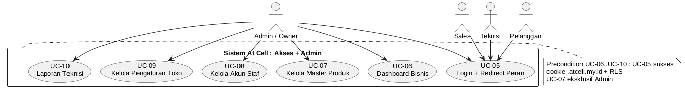
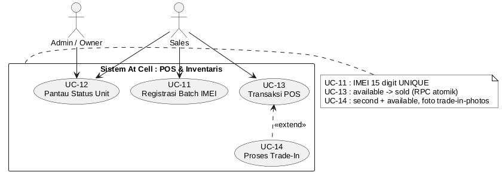
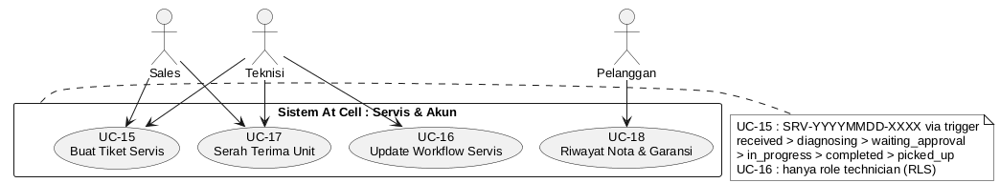
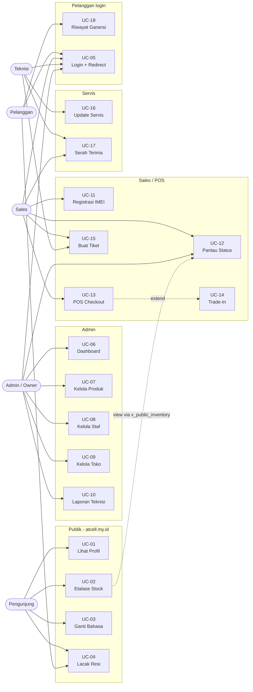

# Use Case — Sistem Operasional & Web Profil "At Cell"

> Sumber: `PRD-AtCell.md` — Next.js + Tailwind + shadcn/ui + Supabase (PostgreSQL)
> Domain: publik `atcell.my.id/[locale]` (`/id` default, `/en`) + operasional `login.atcell.my.id`

## 1. Aktor

| Aktor | Deskripsi | Rute utama |
|---|---|---|
| Pengunjung / Tamu | Publik anonim, tanpa login | `atcell.my.id/[locale]`, `/tracking` |
| Pelanggan | `profiles.role = customer`, punya riwayat nota & garansi | `login.atcell.my.id/account` |
| Sales | `role = sales`, kasir + inventaris | `login.atcell.my.id/pos`, `/inventory` |
| Teknisi | `role = technician`, meja servis | `login.atcell.my.id/service` |
| Admin / Owner | `role = admin`, kendali penuh + master data | `login.atcell.my.id/dashboard` |

## 2. Daftar Use Case

| Kode | Nama | Aktor | Tabel utama |
|---|---|---|---|
| UC-01 | Lihat Profil Toko Multilingual | Pengunjung | `store_settings` |
| UC-02 | Lihat Etalase Ready Stock + Filter | Pengunjung | `v_public_inventory` |
| UC-03 | Ganti Bahasa ID / EN | Pengunjung | — (next-intl) |
| UC-04 | Lacak Resi Servis Publik | Pengunjung | `service_tickets` |
| UC-05 | Login Subdomain + Redirect Peran | Semua terdaftar | `profiles`, Supabase Auth |
| UC-06 | Lihat Dashboard Bisnis + Stok Menipis | Admin | `transactions`, `service_tickets`, `inventory_units` |
| UC-07 | Kelola Master Produk | Admin | `products` |
| UC-08 | Kelola Akun Staf | Admin | `profiles` + Auth |
| UC-09 | Kelola Pengaturan Toko Publik | Admin | `store_settings` |
| UC-10 | Lihat Laporan Performa Teknisi | Admin | `service_tickets` |
| UC-11 | Registrasi Unit Batch IMEI | Sales | `inventory_units` |
| UC-12 | Pantau Status Unit | Sales, Admin | `inventory_units` |
| UC-13 | Transaksi POS + Guest Checkout | Sales | `transactions`, `transaction_items` |
| UC-14 | Proses Trade-In | Sales | `trade_in_records`, `inventory_units` |
| UC-15 | Buat Tiket Servis | Sales, Teknisi | `service_tickets` |
| UC-16 | Update Workflow + Biaya Servis | Teknisi | `service_tickets` |
| UC-17 | Serah Terima Unit (`picked_up`) | Sales, Teknisi | `service_tickets` |
| UC-18 | Lihat Riwayat Nota & Garansi | Pelanggan | `transactions`, `transaction_items` |

Relasi: `UC-13` **include** validasi IMEI `available`. `UC-14` **extend** `UC-13` (dieksekusi atomik dalam satu RPC). `UC-02` membaca view `v_public_inventory`, bukan tabel langsung.

## 3. Diagram Use Case (gaya Sparx EA, UML standar)

> Notasi mengikuti Enterprise Architect: aktor stickman di luar boundary,
> use case ellipse di dalam `rectangle Sistem At Cell`, relasi `<<extend>>` / `<<use>>` garis putus-putus.
> Dibagi per modul agar rapi (praktik EA: 1 diagram besar 18 UC tidak terbaca).
> Sumber PlantUML: `usecase-ea-*.puml`. Render: `plantuml -tpng -tsvg *.puml`.

### 3.1 Publik — `atcell.my.id`



Sumber: `usecase-ea-01-publik.puml` | SVG: `usecase-ea-01-publik.svg`

### 3.2 Akses + Admin



Sumber: `usecase-ea-02-admin.puml` | SVG: `usecase-ea-02-admin.svg`

### 3.3 POS, Inventaris, Trade-In



Sumber: `usecase-ea-03-pos.puml` | SVG: `usecase-ea-03-pos.svg`
Relasi: `UC-13 <.. UC-14 : <<extend>>` — aktor hanya terhubung ke `UC-13`, `UC-14` opsional dan atomik dalam satu RPC.

### 3.4 Servis & Akun Pelanggan



Sumber: `usecase-ea-04-servis.puml` | SVG: `usecase-ea-04-servis.svg`

### 3.5 Diagram gabungan 18 UC (arsip)

`usecase-ea.png` / `usecase-ea.svg` dari `usecase-ea.puml` memuat semua UC dalam 1 boundary.
Layout Smetana (tanpa Graphviz) membuatnya padat dan garis menyilang — disimpan sebagai arsip,
bukan acuan utama. Untuk 1 diagram rapi butuh `graphviz` (`dot`) + `left to right direction`.

<details>
<summary>Diagram Mermaid lama (arsip, bukan UML EA)</summary>


Hasil lama: `usecase.png` / `diagram.mmd`.
</details>

## 4. Spesifikasi Detail

### UC-01 Lihat Profil Toko Multilingual
- **Tujuan:** Menampilkan identitas toko dari DB, bukan hardcode.
- **Pre:** `store_settings` sudah diisi Admin.
- **Alur utama:**
  1. Pengunjung buka `atcell.my.id/id` atau `/en`.
  2. Middleware `next-intl` routing `/[locale]`.
  3. Sistem render hero, keunggulan, jam buka (`opening_hours` jsonb), peta (`latitude/longitude`), alamat, telepon dari `store_settings`.
- **Post:** -.

### UC-02 Lihat Etalase Ready Stock
- **Tujuan:** Filter unit siap jual by merek & kondisi.
- **Pre:** Ada `inventory_units.status = available`.
- **Alur utama:**
  1. Pengunjung buka etalase, pilih filter merek / `new` / `second`.
  2. Sistem query `v_public_inventory` (kolom aman: merek, model, kondisi, harga jual).
  3. Sembunyikan `purchase_cost`.
- **Aturan:** `anon` hanya `SELECT` ke view, tidak ke `products` / `inventory_units` langsung.

### UC-03 Ganti Bahasa
- **Alur utama:** 1. Klik toggle 2. Pindah `/id <-> /en` dengan state filter dipertahankan.
- **Aturan:** `description_id` / `description_en` dari `store_settings`.

### UC-04 Lacak Resi Servis Publik
- **Tujuan:** Transparansi tanpa login.
- **Pre:** `service_tickets.ticket_code` (`SRV-YYYYMMDD-XXXX`) ada.
- **Alur utama:**
  1. Input kode di widget beranda atau halaman `/[locale]/tracking`.
  2. Server Action query by `ticket_code` saja.
  3. Tampil timeline linier `received → diagnosing → waiting_approval → in_progress → completed → picked_up` + `sparepart_fee + labor_fee = total_fee`.
- **Alternatif:** Kode tidak ketemu → pesan error, jangan bocorkan tiket lain.

### UC-05 Login Subdomain + Redirect Peran
- **Pre:** Akun Supabase Auth + `profiles.role` terisi.
- **Alur utama:**
  1. Buka `login.atcell.my.id`, input email + password.
  2. Middleware validasi cookie wildcard `.atcell.my.id`, rewrite ke `/auth-portal/*`.
  3. Redirect: Admin → `/dashboard`, Sales → `/pos`, Teknisi → `/service`, Pelanggan → `/account`.
- **Alternatif:** Role tidak dikenal / sesi expired → kembali ke login + pesan.

### UC-06 Lihat Dashboard Bisnis
- **Aktor:** Admin.
- **Alur utama:** Buka `/dashboard` → lihat grafik omzet harian/bulanan, jumlah transaksi, tiket aktif, daftar model dengan `available < threshold` (threshold dapat diatur).
- **Post:** -.

### UC-07 Kelola Master Produk (eksklusif Admin)
- **Tabel:** `products(brand, model_name, specs, default_price)`.
- **Alur utama:** Tambah / edit / nonaktifkan katalog.
- **Aturan:** RLS: Sales/Teknisi tidak boleh `INSERT/UPDATE/DELETE` ke `products`.

### UC-08 Kelola Akun Staf
- **Alur utama:** Admin undang (Supabase Auth invite) / nonaktifkan / ubah `role` Sales ↔ Teknisi.
- **Aturan:** Tidak boleh ubah role diri sendiri menjadi non-admin jika satu-satunya admin.

### UC-09 Kelola Pengaturan Toko Publik
- **Tabel:** `store_settings` singleton (nama, `description_id/en`, alamat, koordinat, telepon, jam operasional).
- **Alur utama:** Edit form → simpan → langsung tampil di UC-01.

### UC-10 Laporan Performa Teknisi
- **Alur utama:** Pilih rentang tanggal → lihat jumlah tiket `completed`, rata-rata durasi `created_at → updated_at` per `technician_id`.

### UC-11 Registrasi Unit Batch IMEI
- **Aktor:** Sales (Admin bisa).
- **Pre:** `product_id` sudah ada di `products`.
- **Alur utama:**
  1. Pilih produk, input daftar IMEI (batch).
  2. Validasi: 15 digit angka, `UNIQUE` (CHECK regex).
  3. Insert ke `inventory_units(condition, status=available, purchase_cost, selling_price)`.
- **Alternatif:** IMEI duplikat / panjang salah → tolak baris itu + tampilkan baris gagal, yang valid tetap tersimpan atau rollback sesuai opsi.

### UC-12 Pantau Status Unit
- **Status:** `available, reserved, sold, in_service, returned`.
- **Alur utama:** Filter by produk / status / IMEI, lihat mutasi.

### UC-13 Transaksi POS + Guest Checkout
- **Pre:** Unit `status = available`.
- **Alur utama:**
  1. Sales pilih model + IMEI fisik.
  2. Jika pelanggan belum punya akun → catat ringan nama + telepon (`customer_id` nullable, tetap tertaut garansi).
  3. Sistem hitung `subtotal - trade_in_deduction = final_payment` + `payment_method (cash/transfer/qris/debit/credit)`.
  4. Submit → RPC atomik: insert `transactions + transaction_items(warranty_duration_months)` + update IMEI `available → sold`.
  5. Cetak / ekspor faktur bergaransi memuat IMEI.
- **Alternatif:** IMEI sudah `sold/reserved` saat checkout → batalkan + refresh stok.

### UC-14 Proses Trade-In (extend UC-13)
- **Pre:** Pelanggan bawa unit lama + beli unit baru dalam satu transaksi.
- **Alur utama:**
  1. Buka form grading: layar, bodi, baterai, biometrik, sinyal + upload foto ke `trade-in-photos`.
  2. Input `offered_price` sebagai diskon langsung.
  3. Submit bersama UC-13 dalam satu RPC:
     - `transactions.trade_in_deduction` terisi,
     - insert `trade_in_records(original_brand_model, imei, grading_details jsonb, photo_urls jsonb, offered_price, resulting_unit_id)`,
     - insert unit lama ke `inventory_units(condition=second, status=available)`.
- **Aturan:** Harus atomik — gagal satu, gagal semua.

### UC-15 Buat Tiket Servis
- **Aktor:** Sales / Teknisi.
- **Alur utama:**
  1. Input `customer_name/phone` (atau `customer_id` jika member), `device_model`, `imei_or_sn`, `issue_notes`, foto awal ke `service-photos`.
  2. Insert → trigger `BEFORE INSERT` generate `ticket_code SRV-YYYYMMDD-XXXX` atomik (anti race-condition).
  3. Status awal `received`, serahkan resi ke pelanggan.

### UC-16 Update Workflow + Biaya Servis
- **Aktor:** Teknisi.
- **Alur:** `received → diagnosing → waiting_approval → in_progress → completed`, tiap pindah status update `sparepart_fee + labor_fee = total_fee` + foto bukti + catatan. Hanya `role = technician` boleh update (RLS).

### UC-17 Serah Terima Unit
- **Alur utama:** Pelanggan datang → catat pelunasan → status `completed → picked_up`.
- **Post:** Tiket tertutup, unit keluar dari antrean aktif.

### UC-18 Lihat Riwayat Nota & Garansi
- **Aktor:** Pelanggan login.
- **Alur utama:** Buka `/account` → daftar `transactions` + `transaction_items` (unit, IMEI, `warranty_duration_months`) → unduh faktur ulang.

## 5. Cara Melihat & Mengedit Gambar (gaya EA)

### Lihat cepat
```bash
cd /home/neki/Code/KP/docs
xdg-open usecase-ea-01-publik.png
xdg-open usecase-ea-02-admin.png
xdg-open usecase-ea-03-pos.png
xdg-open usecase-ea-04-servis.png
# versi vektor (tajam untuk cetak):
xdg-open usecase-ea-01-publik.svg
```
Di VS Code: klik file `.png` / `.svg` langsung. Di Markdown preview file ini, gambar `` tampil otomatis. Di GitHub, PNG ter-render otomatis (PlantUML `.puml` tidak, harus PNG/SVG).

### Edit lalu render ulang (PlantUML, sudah terinstall)
```bash
cd /home/neki/Code/KP/docs
# edit salah satu:
# usecase-ea-01-publik.puml
# usecase-ea-02-admin.puml
# usecase-ea-03-pos.puml
# usecase-ea-04-servis.puml
# usecase-ea.puml (gabungan, arsip)

plantuml -tpng usecase-ea-01-publik.puml usecase-ea-02-admin.puml usecase-ea-03-pos.puml usecase-ea-04-servis.puml
plantuml -tsvg usecase-ea-01-publik.puml usecase-ea-02-admin.puml usecase-ea-03-pos.puml usecase-ea-04-servis.puml
```
Catatan: render saat ini memakai `!pragma layout smetana` agar jalan tanpa `graphviz`.
Untuk layout ortogonal rapi 1-diagram-besar ala EA, install `graphviz` (`dot`) lalu pakai `left to right direction` + `linetype ortho` — konfirmasi dulu sebelum saya installkan.

### Bawa ke Sparx EA
Sparx EA tidak import `.puml` langsung. Cara manual (5 menit):
1. Di EA: buat Package `At Cell` → 4 Use Case Diagram: `Publik`, `Admin`, `POS`, `Servis`.
2. Tiap diagram: drag Actor (stickman) + tambahkan UseCase ellipse sesuai `UC-*.puml` (nama sudah `UC-xx + judul`).
3. Buat Boundary `Sistem At Cell`, masukkan use case ke dalamnya.
4. Relasi: `Sales → UC-13`, `UC-14 → UC-13` sebagai `Extend` (tanpa aktor langsung ke UC-14), `UC-02 → UC-12` sebagai `Use`.
5. Untuk dokumen: pakai PNG/SVG di folder ini langsung (sudah putih, tanpa shadow, монохром ala EA).

File di folder ini:
- `usecase-ea-01..04-publik/admin/pos/servis.puml` — sumber (edit di sini)
- `usecase-ea-01..04-*.png` / `.svg` — hasil siap dokumen / EA trace
- `usecase-ea.puml` / `.png` / `.svg` — gabungan 18 UC, arsip
- `diagram.mmd` / `usecase.png` / `usecase.svg` — Mermaid lama, arsip
